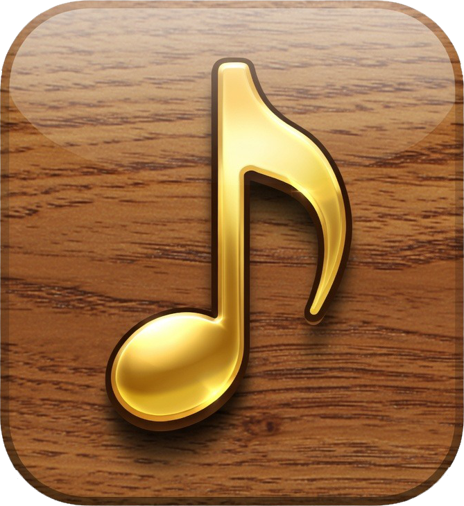
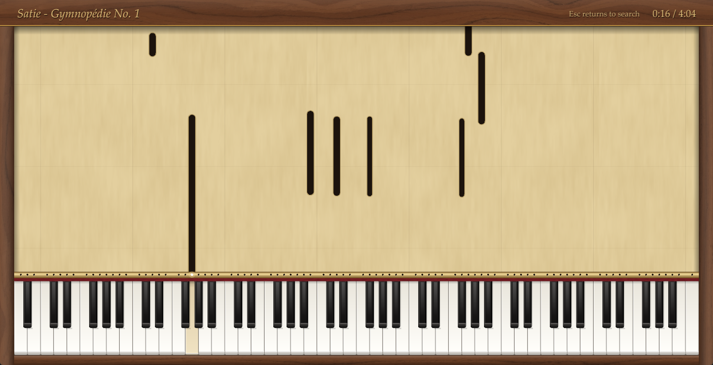
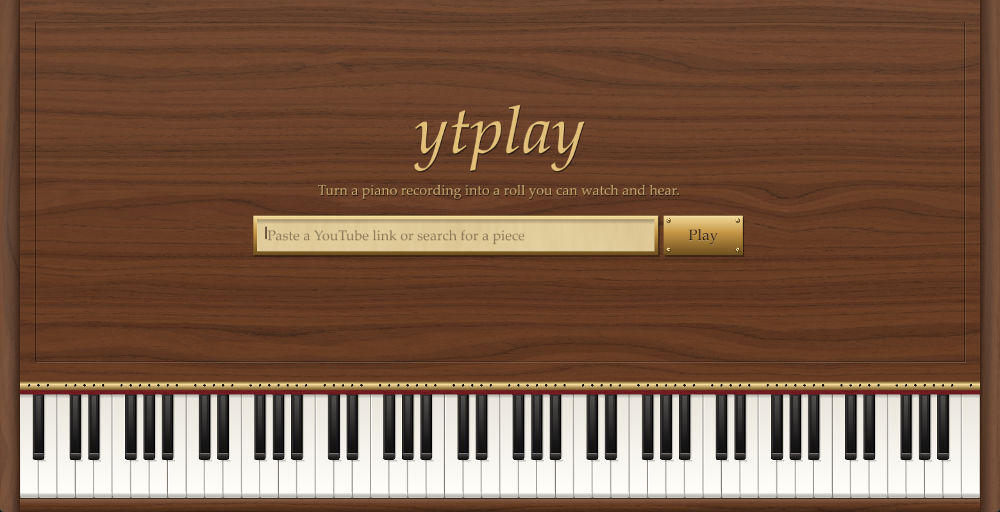
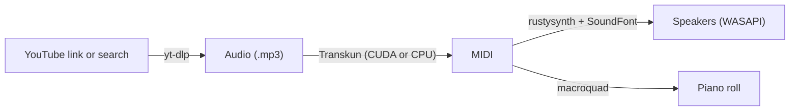

<div align="center">



# ytplay

**Turn any piano video into a player-piano roll you can watch and hear.**

[](https://www.rust-lang.org)
[](#requirements)
[](#gpu-transcription)
[](https://github.com/Yujia-Yan/Transkun)

<br>



</div>

<br>

Paste a YouTube link, or just type the name of a piece. ytplay downloads the audio, transcribes every note with a neural network, and plays the result back through a piano SoundFont while the notes scroll down a paper roll onto the keys.

## Features

- **Link or search.** Paste a URL or type *"satie gymnopedie 1 piano"*; the first result is used.
- **GPU transcription.** [Transkun](https://github.com/Yujia-Yan/Transkun) runs on CUDA when it can and falls back to the CPU when it can't.
- **Cached.** Every download and transcription is kept, so a piece you've played before starts without being downloaded or transcribed again.
- **A real-looking instrument.** Walnut cabinet, brass tracker bar, punched paper roll, and a 2.5D keyboard whose keys go down as they play.
- **Playable.** Click or drag across the keys on the title screen to play them yourself.
- **Replay.** When the roll ends, press <kbd>Enter</kbd> to play it again or <kbd>Esc</kbd> to pick another piece.
- **One file.** A single ~4 MB `.exe` with every texture and the icon built in.

<div align="center">

</div>

## Requirements

| | |
|---|---|
| **OS** | Windows 10 or 11 |
| **Tools on `PATH`** | [`yt-dlp`](https://github.com/yt-dlp/yt-dlp), [`ffmpeg`](https://ffmpeg.org), `python` |
| **Transcription** | `transkun` (Python package) |
| **Sound** | Any piano SoundFont (`.sf2`) |
| **To build** | Rust toolchain (MSVC) |

## Getting started

**1. Install the tools**

```bash
winget install yt-dlp.yt-dlp Gyan.FFmpeg
```

```bash
pip install transkun "setuptools<81"
```

Transkun still imports `pkg_resources`, which newer `setuptools` releases removed; the version pin keeps it working.

**2. Add a SoundFont**

Put a piano SoundFont at `%USERPROFILE%\ytplay\soundfont.sf2`. The free [Salamander Grand Piano](https://freepats.zenvoid.org/Piano/acoustic-grand-piano.html) is a good choice.

**3. Build and run**

```bash
cargo build --release
```

The app is `target\release\ytplay.exe`. Copy it anywhere you like.

### GPU transcription

With an NVIDIA GPU, install the CUDA build of PyTorch so Transkun runs on the GPU:

```bash
pip install --force-reinstall torch torchaudio --index-url https://download.pytorch.org/whl/cu130
```

Without it, ytplay transcribes on the CPU automatically.

## Controls

| Key | Where | Action |
|---|---|---|
| <kbd>Enter</kbd> | Title screen | Download, transcribe and play |
| Mouse | Title screen | Play the piano yourself |
| <kbd>Esc</kbd> | While playing | Back to the title screen |
| <kbd>Enter</kbd> | End of the roll | Play the piece again |

## How it works



The audio thread is the clock: the roll is drawn from the number of samples sent to the speakers, so picture and sound can't drift apart. Everything ytplay keeps lives in `%USERPROFILE%\ytplay`:

```
ytplay\
├── soundfont.sf2       the piano sound
└── cache\
    ├── <video id>.mp3  downloaded audio
    └── <video id>.mid  transcription
```

To change the app icon, replace `icon.png` and rebuild; `build.rs` generates the window and `.exe` icons from it.

## Built with

- [Transkun](https://github.com/Yujia-Yan/Transkun): piano transcription
- [yt-dlp](https://github.com/yt-dlp/yt-dlp): audio download
- [rustysynth](https://github.com/sinshu/rustysynth): SoundFont synthesizer
- [macroquad](https://github.com/not-fl3/macroquad): window and drawing
- [cpal](https://github.com/RustAudio/cpal): audio output
- [midly](https://github.com/kovaxis/midly): MIDI parsing
- [Black Walnut Veneer 02](https://polyhaven.com/a/black_walnut_veneer_02) from Poly Haven (CC0): cabinet wood
